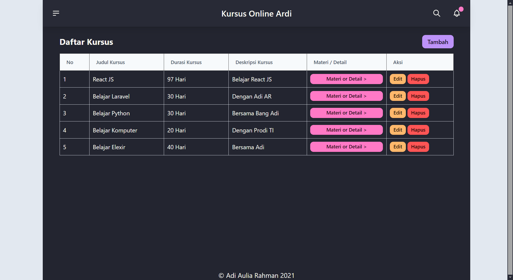
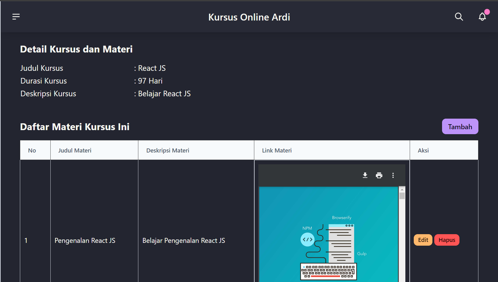

# Sistem Informasi Kurus Online
## Dibuat Oleh  : Adi Aulia Rahman
## Asal         : Politeknik Negeri Tanah Laut

## Fitur Sistem Informasi Kursus MSIB
- Menambahkan Kursus
- Melihat Kursus
- Mengubah Kursus
- Menghapus Kursus
- Menambahkan Materi-materi di dalam Kursus
- Melihat Materi-materi di dalam Kurus
- Mengubah Materi-materi di dalam Kurus
- Menghapus Materi-materi di dalam Kurus

## Cara Installasi Project Sistem Infomasi Kursus Online
- 1.Clone Project `https://github.com/adiarhmn/adi-msib-kursus.git`
- 2.Masuk ke dalam Project Kursus
- 3.Jalankan Perintah ``composer install``
- 4.Rename file `.env.example` jadi `.env`
- 5.Jalankan Perintah `php artisan key:generate`
- 6.Jalankan Perintah ``php artisan migrate``
- 7.Jalankan Perintah `npm install && npm run build`
- 8.Jalankan Perintah `php artisan serve`

## Dokumentasi Sistem Informais Kursus Online
# Halaman Kursus

# Halaman Materi Dari Kursus Yang Dipilih
